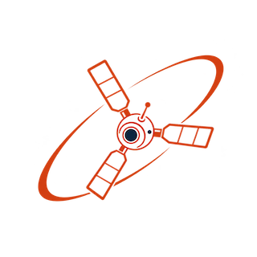
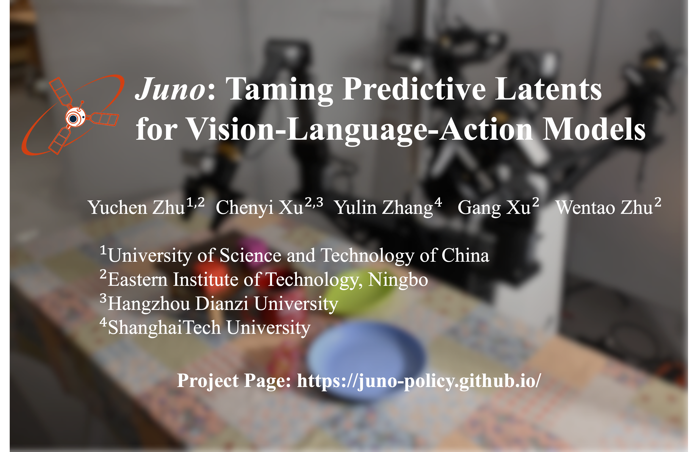
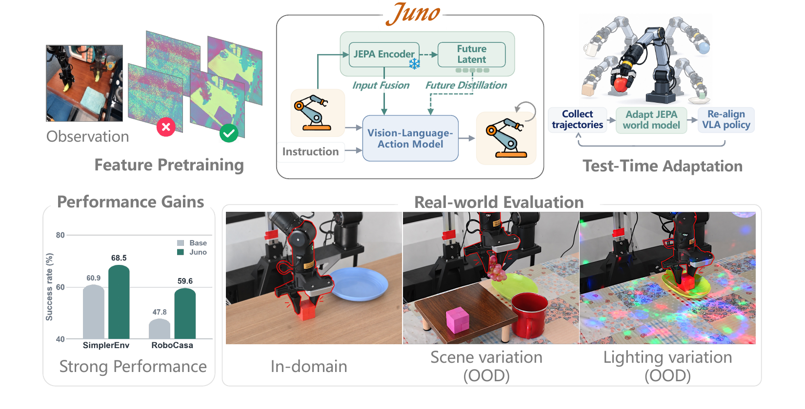
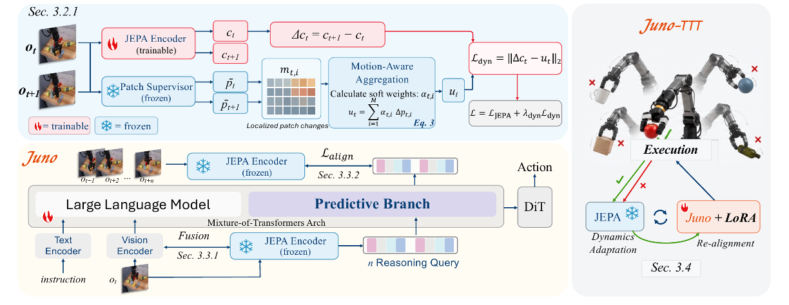

<!--  -->

# Juno: Taming Predictive Latents for Vision-Language-Action Models

**Yuchen Zhu**, **Chenyi Xu**, **Yulin Zhang**, **Gang Xu**, **Wentao Zhu**

[](https://arxiv.org/abs/2610.09940)



 ---

Juno studies how predictive visual latents can help a vision-language-action (VLA) policy reason about the consequences of its actions. The method aligns future visual representations with the control stream, while a mixture-of-transformers action branch keeps language-conditioned reasoning and action prediction coupled.

The release is organized as a small, reproducible repository. It contains the Juno training stack, the standalone `juno-policy` model, a Bridge/Fractal configuration, and a launcher whose paths are supplied through environment variables.

## News

**[2026/10]** 🚀 The paper is available on [arXiv](https://arxiv.org/abs/2610.09940).
**[2026/10]** 🚀 Initial standalone release of the Juno Bridge/Fractal policy-learning recipe.

**TODO**

- [ ] TTT code
- [ ] Checkpoints Release
- [ ] RoboCasa training code
- [ ] JEPA training code


## Overview and Key Features


*Overview of Juno. Future-frame JEPA targets are aligned with the control stream of a vision-language-action policy, while a mixture-of-transformers reasoning branch keeps language-conditioned prediction coupled to action generation.*

**Training pipeline (click to expand)**


*Training pipeline of the released Bridge/Fractal policy-learning stage. Dataset and checkpoint paths are runtime inputs; the launcher records the resolved config and run directory through the Juno trainer.*


**What is released**

This repository releases the **Bridge/Fractal policy-learning stage** used to train the `juno-policy` model. JEPA pretraining and Juno-TTT adaptation are described in the paper.

The released configuration uses a frozen ViT-Base CLS/patch target, an alignment weight of `0.2`, and an input cross-attention scale of `0.5`, as recorded in `configs/bridge_fractal_jepa7_mot_1005.yaml`.

```text
juno_policy.py
└── JunoPolicy(Qwen_GR00T)
    ├── frozen JEPA target encoder
    ├── reasoning-query alignment
    ├── JEPA patch cross-attention at Qwen image slots
    ├── Qwen action backbone
    └── Mixture-of-Transformers reasoning branch
```

---

## 🎒 Quick Start

> **📖 First run?** Clone the repo, install the training stack, then point `BASE_VLM`, `OXE_DATA_ROOT`, and `JEPA_CKPT_PATH` at assets kept outside this repository. See [docs/reproducibility.md](docs/reproducibility.md) for the exact recipe.

### 1. Clone and install

The training environment follows the same conda recipe as StarVLA (`python=3.10`), with the environment renamed to `Juno`.

```bash
git clone https://github.com/juno-policy/Juno.git
cd Juno

conda create -n Juno python=3.10 -y
conda activate Juno

pip install -r requirements.txt
pip install flash-attn --no-build-isolation
pip install -e .
```

This stack matches a working StarVLA environment: Python 3.10, PyTorch 2.8 + CUDA 12.8, `transformers==4.57.0`, `accelerate==1.5.2`, `deepspeed==0.16.9`, and `peft==0.17.1`. Install a CUDA-compatible PyTorch build for your cluster if `pip install -r requirements.txt` does not already pull one.

<details>
<summary><b>⚠️ Common Issues</b></summary>

`flash-attn` must match your CUDA toolkit (`nvcc`) and PyTorch versions. The `--no-build-isolation` flag resolves most issues. Check your environment:

```bash
nvcc -V
pip list | grep -E 'torch|transformers|flash-attn'
```

We have verified that `flash-attn==2.7.4.post1` works well with nvcc `12.0` / `12.4`. On CUDA 12.8 clusters, pick a flash-attn wheel that matches PyTorch 2.8.

</details>

### 2. Prepare external assets

Keep datasets and checkpoints outside this repository. Set:

```bash
export BASE_VLM=/path/to/Qwen3-VL-4B-Instruct
export OXE_DATA_ROOT=/path/to/bridge_fractal_lerobot
export JEPA_CKPT_PATH=/path/to/jepa_encoder.pt
# Optional: external le-wm package and experiment settings
export LEWM_ROOT=/path/to/le-wm
export NUM_PROCESSES=8
export WANDB_PROJECT=juno-policy
```

`BASE_VLM`, `OXE_DATA_ROOT`, and `JEPA_CKPT_PATH` are required. After `conda activate Juno`, the launcher uses that environment's `python`, writes runs under `runs/`, and supports `PYTHON_BIN`, `CONFIG_PATH`, `RUN_ROOT_DIR`, `RUN_ID`, `IS_RESUME`, `WANDB_MODE`, and `WANDB_ENTITY` overrides.

### 3. Validate and train

```bash
conda activate Juno
bash scripts/validate.sh
bash scripts/run_bridge_fractal_jepa7_mot_train.sh
```

The command uses DeepSpeed ZeRO-2 and the launch settings in `juno/config/deepseeds/deepspeed_zero2.yaml`. Start with a small `NUM_PROCESSES` and an offline W&B run when checking a new cluster.

---


## Benchmark Results

The numbers below are **reported paper results**, not a benchmark run generated by this repository. SimplerEnv entries are means over 4 evaluation runs. RoboCasa-GR1 uses 50 episodes per task. Each real-robot condition uses 20 trials. The best result in each column is in bold. See the paper for task definitions and evaluation details.

**SimplerEnv (WidowX)**

Success rate (%). Arrows are the change from Qwen3GR00T.


| Method                  | Average          | Spoon on Towel   | Carrot on Plate | Stack Green Block | Eggplant in Basket |
| ----------------------- | ---------------- | ---------------- | --------------- | ----------------- | ------------------ |
| OpenVLA-OFT             | 41.8             | 34.2             | 30.0            | 30.0              | 72.5               |
| RoboVLM                 | 42.7             | 50.0             | 37.5            | 0.0               | 83.3               |
| Magma                   | 44.8             | 37.5             | 29.2            | 20.8              | 91.7               |
| CogACT                  | 51.3             | 71.7             | 50.8            | 15.0              | 67.5               |
| SpatialVLA              | 34.4             | 20.8             | 20.8            | 25.0              | 70.8               |
| TraceVLA                | 27.7             | 12.5             | 16.6            | 16.6              | 65.0               |
| VideoVLA                | 53.1             | 75.0             | 20.8            | **45.8**          | 70.8               |
| VLA-JEPA                | 57.3             | 75.0             | **70.8**        | 12.5              | 70.8               |
| π0                      | 53.1             | 29.2             | 62.5            | 29.2              | 91.6               |
| π0.5                    | 57.1             | 49.3             | 64.7            | 44.7              | 69.7               |
| Isaac-GR00T-N1.6-Bridge | 57.1             | 64.5             | 65.5            | 5.5               | 93.0               |
| Qwen3GR00T              | 60.9             | 72.9             | 60.4            | 14.6              | 95.8               |
| Juno                    | 68.5 (↑7.6)      | 86.5 (↑13.6)     | 59.4 (↓1.0)     | 31.3 (↑16.7)      | **96.9** (↑1.1)    |
| Juno-TTT                | **72.7** (↑11.8) | **94.8** (↑21.9) | 62.5 (↑2.1)     | 37.5 (↑22.9)      | 95.8               |


**RoboCasa-GR1 Tabletop**

Unweighted mean success rate (%) within each task group. Average is over all 24 tasks.


| Method     | PnP + Close | Cuttingboard | Placemat | Plate    | Tray     | Avg.     |
| ---------- | ----------- | ------------ | -------- | -------- | -------- | -------- |
| GR00T-N1.6 | 24.2        | 56.9         | 51.9     | 57.6     | **55.1** | 47.6     |
| Qwen3PI    | 42.3        | 46.0         | 43.5     | 44.0     | 44.0     | 43.9     |
| Qwen3OFT   | 43.7        | 50.4         | 41.5     | 61.0     | 49.2     | 48.8     |
| Qwen3FAST  | 35.0        | 50.4         | 33.5     | 45.0     | 32.0     | 39.0     |
| Qwen3GR00T | 50.3        | 52.8         | 38.0     | 58.5     | 39.2     | 47.8     |
| Juno       | **57.3**    | **64.8**     | **55.5** | **68.0** | 53.6     | **59.6** |


**Real robot, frozen policy (ALOHA right arm)**

Success rate (%) over 20 trials. Shifts are cumulative: background, then height, then object.


| Method     | In-Domain         | Background        | + Height          | + Height + Object |
| ---------- | ----------------- | ----------------- | ----------------- | ----------------- |
| Qwen3GR00T | 40.0 (8/20)       | 0.0 (0/20)        | 0.0 (0/20)        | 0.0 (0/20)        |
| Juno       | **100.0 (20/20)** | **75.0 (15/20)**  | **70.0 (14/20)**  | **70.0 (14/20)**  |


**Real robot, test-time training**

Success rate (%) over 20 trials. Juno-TTT is adapted separately in each condition.


| Method        | Gaussian Noise   | Dynamic Lighting |
| ------------- | ---------------- | ---------------- |
| Juno (frozen) | 40.0 (8/20)      | 55.0 (11/20)     |
| Juno-TTT      | **65.0 (13/20)** | **70.0 (14/20)** |


---


## Repository layout

```text
Juno/
├── assets/                         # Icon and paper figures
├── configs/                        # Reproducible training configuration
├── deployment/                     # Image preprocessing helpers used by Juno
├── docs/                           # Reproducibility and source map notes
├── scripts/                        # Validation and training entry points
├── juno/
│   ├── model/framework/VLM4A/      # QwenGR00T base + juno_policy.py
│   ├── model/modules/world_model/  # JEPA modules
│   ├── dataloader/                 # LeRobot mixture and transforms
│   └── training/                   # Juno trainer
├── CITATION.cff
├── LICENSE
└── requirements.txt
```

- Dataset and checkpoint paths are runtime inputs; no private machine paths are required.
- `docs/source_map.md` maps the paper concepts to the implementation files.
- `docs/reproducibility.md` lists the exact recipe and the differences between this policy stage and the full paper system.

<!-- --- -->


## Cite Juno

If you use Juno, please cite the [paper](https://arxiv.org/abs/2610.09940):

```bibtex
@misc{zhu2026junotamingpredictivelatents,
      title={Juno: Taming Predictive Latents for Vision-Language-Action Models}, 
      author={Yuchen Zhu and Chenyi Xu and Yulin Zhang and Gang Xu and Wentao Zhu},
      year={2026},
      eprint={2610.09940},
      archivePrefix={arXiv},
      primaryClass={cs.RO},
      url={https://arxiv.org/abs/2610.09940}, 
}
```


## Acknowledgements

This project draws inspiration and references from several notable open-source initiatives, including:

- [StarVLA](https://github.com/starVLA/starVLA)
- [Qwen-VL](https://github.com/QwenLM/Qwen3-VL)
- [LeRobot](https://github.com/huggingface/lerobot)
- [GR00T](https://github.com/NVIDIA/Isaac-GR00T)
- [DeepSpeed](https://github.com/deepspeedai/DeepSpeed)

Please follow the upstream licenses and model terms when redistributing weights or datasets.

<!-- ## Star History

Here's how our community has grown over time:

 -->
